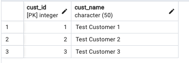
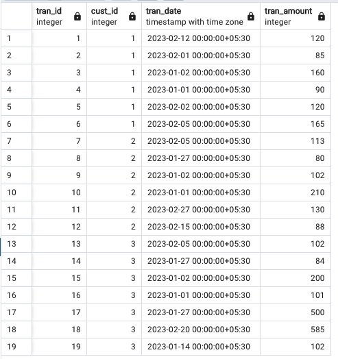
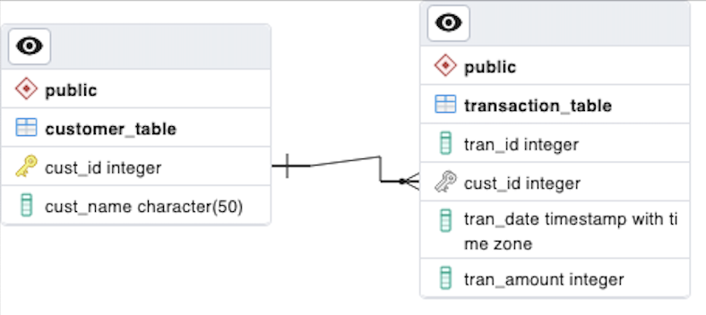

# Chartered Coding Challenge

This will expose the rest API to get Customer rewards point based on customer ID

### The problem Statement was below

- A retailer offers a rewards program to its customers awarding points based on each recorded purchase as follows

- For every dollar spent over $50 on the transaction, the customer receives one point. In addition, for every dollar spent over $100, the customer receives another point. Ex: for a $120 purchase, the customer receives

### CUSTOMER_TABLE



### TRANSACTIONS_TABLE



### Entity Relationship Diagram



- used PostGresSQL database for strong information
- Run SQL script to insert test data
- Change configuration in application.properties file for DB Information
  
run charterAppApplication file or run the following command in terminal

```./mvnw spring-boot:run```

### Sample Request

```http://localhost:8080/rewards/1```

### Sample Response

```json
{
    "custId": 1,
    "lastMothRP": 395,
    "lastSecMonthRP": 210,
    "lastThirdMonthRP": 0,
    "totalRewards": 605
}
```

### you can also find postman collection in root folder which you can import to run the endpoint directly
